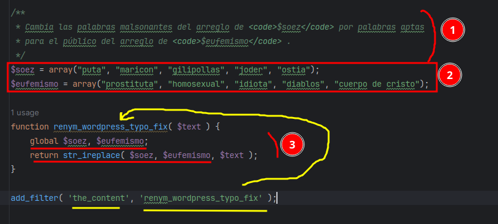

# TAREAS
## Tarea: Plugin (filter)Tarefa - Enunciado
Realiza un plugin en WP que utilice el hook 'the_content' (fijaros en los comentarios, hay mucha información muy interesante):

El plugin tiene que recorrer el contenido del post (esto ya lo hace el hook) y sustituir cinco palabras (pueden ser, por ejemplo, malsonantes) por otras. Utiliza array o algín tipo de dato parecido en PHP.

Ten en cuenta que este plugin vamos a seguir trabajando en él para que utilice la base de datos de WP y también que se pueda configurar desde el backend. Por lo tanto, estructura bien el código, separa los datos de la parte lógica, realiza funciones sencillas que realizen una sola cosa. De esta manera podremos ir evolucinando el código.

Adjunta el repositorio con únicamente el directorio del plugin, con un Readme explicatorio.

Se tiene que poder clonar el repositorio directamente en la carpeta plugin y activarlo desde cualquier instalación de WP.
## Solución
### Primeros pasos
1. Me dirijo a la carpeta word (pasos: 1,2 y 3).
2. Creo el readme y un archivo _.php_ (paso: 4).

   

### Creamos la función y la añadimos al filtro
Después de pegar en el archivo _.php_ el código subido a Esemtia:


1. Documento el metodo explicando su función.
2. Añado las variables de tipo `array()` cuyos elementos se intercambiarán en la función.
3. Convierto esas variables a globales para que las pueda utilizar 
en el cuerpo de la función y las devuelvo.



>Lo que esta indicado en amarillo muestra que le estoy 
> pasando el metodo al filtro
> "the content".

_Nota: He cambiado el metodo `str_replace()` 
del código copiado por `str_ireplace()` el cual
, al contrario que el anterior, no tiene en cuenta "caseSensitive"._

### Configuracion wordpres
Abro mi wordpress en el navegador, activo el pluggin y lo checkeo
 para que se visualizce:


### Resultado
Observo que en el lado del cliente, se cambian las palabras malsonantes por los
eufemismos

Servidor:

Cliente:


## Tarea: Plugin + Base de DatosTarefa - Enunciado
Modifica el plugin del ejercicio anterior, para que recoja y use las palabras de una tabla de la base de datos.

En este repositorio, tienes un ejemplo de como crear una tabla.

Entrega el enlace al repositorio (puede ser el mismo que el anterior), y realiza una `release` con el zip del plugin para poder instalarlo en cualquier wordpress.

## Solución
### Primeros pasos
>El objetivo es que las palabras las guarde en una tabla en la base de datos
>para poder hacer el cambio, de palabras soeces por eufemismos, desde los registros de la misma.

Primero conecto con el IDE la base de datos.
 

Vamos a esemtia y buscamos el uso de la bd. Plantilla:

```php
function createTable() {
    global $wpdb;
    
    // "->" equivale al "." en java
    $charset_collate = $wpdb->get_charset_collate();
    
    // le añado el prefijo a la tabla
    $table_name = $wpdb->prefix . 'dam';
    
    // creamos la sentencia sql
    
    $sql = "CREATE TABLE IF NOT EXISTS $table_name (
    id mediumint(9) NOT NULL AUTO_INCREMENT,
    time datetime DEFAULT '0000-00-00 00:00:00' NOT NULL,
    name tinytext NOT NULL,
    text text NOT NULL,
    url varchar(55) DEFAULT '' NOT NULL,
    PRIMARY KEY (id)
    ) $charset_collate;";
    
    require_once( ABSPATH . 'wp-admin/includes/upgrade.php' );
    // funcion de wp que ejecuta un sql
    dbDelta( $sql );
}
// llamo al metodo anterior cuando se acticva el plugin
add_action( 'plugins_loaded', 'createTable' );
```
Utilizamos `add_action` en vez de `add_filter` ya que el primero
se utiliza para llamar metodos de manera puntual y el segundo para
llamarlos frecuentemente.

### Implementación metodos
Apadtamos el método a nuestro código, activamos y desactivamos
el plugin y debería aparecer en el IDE la nueva tabla creada:


------

Insertamos registros en la tabla con el método `ìnsertRow()` y 
volvemos a utilizar el método `add_action()` para que se cargue el 
método.

Comprobamos que se han insertado los registros correctamente:


(De momento solo hemos insertado registros, 
aún no intercambiado las palabras).

----

Gracias a los métodos `selectData()` y
`renym_wordpress_typo_fix()`, 
leemos los registros de la tabla y 
aplicamos el intercambio de palabras 
respectivamente a partir de estos registros.

_Recordar que el método `renym_wordpress_typo_fix()`
fue el que utilizamos en la [practica anterior](#tarea-plugin-filtertarefa---enunciado) 
para intercambiar las palabras del arreglo de palabras soeces por el de eufemismos._

----

Por último documentamos el código y creamos la realease para subirla a 
repositorio de GitHub.


